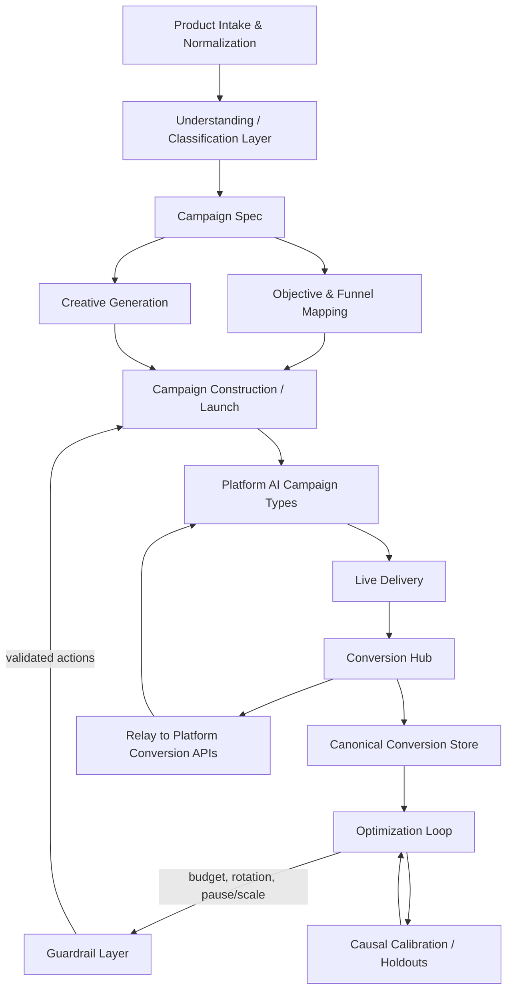
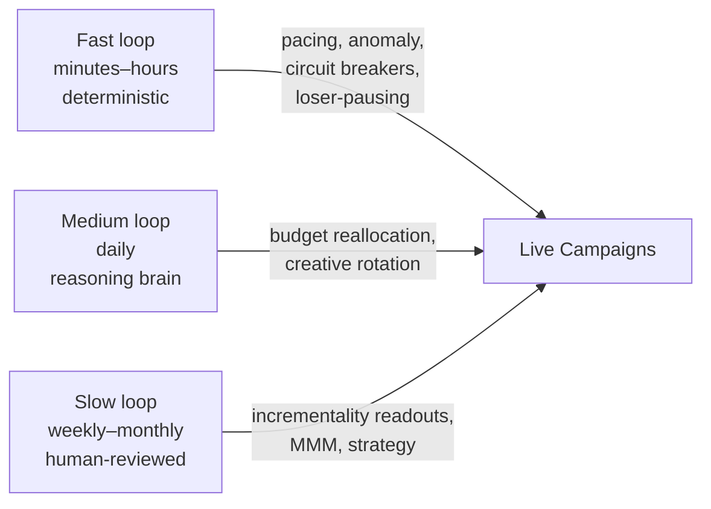

# Autonomous Multi-Vertical Advertising Engine

**Software Design Documentation**

| | |
|---|---|
| **Document type** | System design / architecture specification |
| **Status** | Design baseline (pre-build) |
| **Scope** | Vertical-agnostic automated advertising engine for Meta, Google, and TikTok |
| **Audience** | Engineering, future build agents (Claude Code), technical stakeholders |

---

## Table of Contents

1. [Overview](#1-overview)
2. [Goals and Non-Goals](#2-goals-and-non-goals)
3. [Core Concepts and Glossary](#3-core-concepts-and-glossary)
4. [System Architecture](#4-system-architecture)
5. [Component Specifications](#5-component-specifications)
6. [Data Model](#6-data-model)
7. [Interfaces and API Contracts](#7-interfaces-and-api-contracts)
8. [Conversion Tracking and Attribution](#8-conversion-tracking-and-attribution)
9. [Optimization and Autonomy Model](#9-optimization-and-autonomy-model)
10. [Safety, Governance, and Compliance](#10-safety-governance-and-compliance)
11. [Observability and Evaluation](#11-observability-and-evaluation)
12. [External Platform Integration](#12-external-platform-integration)
13. [Technology Stack](#13-technology-stack)
14. [Build Phases](#14-build-phases)
15. [Failure Modes and Known Limitations](#15-failure-modes-and-known-limitations)
16. [Appendices](#16-appendices)

---

## 1. Overview

The Autonomous Advertising Engine (hereafter "the engine") is a vertical-agnostic system that takes **products** as input and produces **running, self-optimizing advertising campaigns** across Meta, Google, and TikTok, with full-funnel conversion tracking and conversion-driven automatic adjustment.

The input is a product — either a catalog item (e-commerce) or an offer description (services, lead generation, B2B, booking). The engine classifies it, generates the creative, launches campaigns on the appropriate platform AI campaign types, ingests conversion data through the full funnel (view → add-to-cart → checkout → payment, or lead submission), and continuously reallocates budget and refreshes creative based on those conversions.

### 1.1 Core design principle

A single system serves any vertical because every product maps into **one canonical campaign specification** through a **classification layer**. Downstream of the spec, the launch and optimization logic is identical for a property, an EV charger, a service booking, or a retail SKU — only the *values* in the spec differ. "Understanding any vertical" reduces mechanically to "fill the spec correctly for this product." The two assets that vary by vertical are the **playbook library** (which fills the spec) and the **conversion-event map** (which defines the funnel). The engine code does not.

### 1.2 Positioning relative to platform AI

The engine is a **meta-layer** over the platforms' own AI campaign types (Meta Advantage+, Google Performance Max / AI Max, TikTok Smart+ / GMV Max). Those campaign types already perform impression-level targeting, placement, and bid optimization. The engine does **not** attempt to out-optimize them at that level. It operates one level up: deciding which campaign types to run, how much budget each receives, when to launch or kill them, what creative to feed them, and which conversion event to optimize toward — and it closes the measurement loop the platforms structurally cannot, because each platform sees only its own walled garden.

### 1.3 Measurement posture

The engine is a **server-side conversion hub**. Conversion events arrive from product sites via API; the engine relays them to each platform's conversion endpoint and retains a canonical copy as the single cross-platform source of truth. The engine does **not** own or host the landing pages. This is addressed in detail in [Section 8](#8-conversion-tracking-and-attribution); the single hard dependency it creates is the inbound conversion contract.

---

## 2. Goals and Non-Goals

### 2.1 Goals

- Accept products of any vertical through a uniform intake interface.
- Generate platform-compliant ad creative (image, video, copy) in all required placement formats.
- Launch and manage campaigns across Meta, Google, and TikTok.
- Track the complete conversion funnel: ViewContent, AddToCart, InitiateCheckout, Purchase/CompletePayment, and Lead/SubmitForm.
- Optimize automatically on conversion data — reallocating budget, rotating creative, pausing losers, scaling winners.
- Operate under hard financial and policy guardrails with a verifiable audit trail.
- Increase autonomy progressively as decision quality is proven against a human baseline.

### 2.2 Non-Goals

- **Not** a landing-page builder or hosting platform. The engine consumes conversion data; it does not own the post-click destination.
- **Not** a replacement for platform-level bid optimization. It orchestrates platform AI campaign types rather than competing with them.
- **Not** a single-vertical tool. Any logic that hardcodes a specific vertical's assumptions belongs in a playbook, not in the engine.
- **Architected for autonomy from day 1, not throttled by a calendar.** The full autonomy machinery ships in the first build. The gate on *acting* autonomously is data sufficiency per slice, not elapsed time, and hard safety bounds persist at every autonomy level ([Section 9](#9-optimization-and-autonomy-model)).
- **Not** a multi-touch attribution product. Platform-reported conversions are reconciled, not treated as ground truth ([Section 8.5](#85-reconciliation-reconcile-do-not-sum)).

---

## 3. Core Concepts and Glossary

| Term | Definition |
|---|---|
| **Product object** | The normalized internal representation of any input, whether a catalog SKU or an offer description. |
| **Campaign spec** | The canonical specification every product maps into; drives all downstream logic. |
| **Playbook** | A reusable, vertical-specific template that fills the campaign spec: objective, funnel events, creative angles, format mix, audience strategy, and compliance constraints. |
| **Conversion hub** | The engine's role as a server-side relay and canonical store for conversion events. |
| **Platform AI campaign type** | A black-box, AI-driven campaign product: Advantage+ (Meta), Performance Max / AI Max (Google), Smart+ / GMV Max (TikTok). |
| **Click ID** | A platform-stamped identifier on the landing URL that ties a conversion back to the ad click: `fbc`/`fbclid` (Meta), `ttclid` (TikTok), `gclid`/`gbraid`/`wbraid` (Google). |
| **Event Match Quality (EMQ)** | A platform score for how well server-sent conversion events match a known user; higher EMQ correlates with materially lower acquisition cost. |
| **Learning phase** | The period during which a platform optimizer gathers enough conversions to stabilize. Roughly 50 optimization-event conversions per week per ad set/ad group is the common threshold. |
| **Terminal event** | The deepest conversion event in a vertical's funnel (e.g., Purchase for e-commerce, Lead for lead generation). |
| **Optimization event** | The event the engine actually instructs the platform to optimize toward — not always the terminal event, due to volume (see [Section 5.3](#53-objective-and-funnel-mapping)). |
| **iROAS** | Incremental return on ad spend, measured via holdout experiments; the causal counterpart to platform-reported ROAS. |
| **Operating cost (AI)** | The engine's own inference cost — model calls for product understanding, creative generation, and the plain-language layer. Tracked separately from ad spend. |
| **Total cost** | Ad spend plus operating cost. The true cost of running advertising and the basis for true unit economics. |
| **Net return** | Revenue divided by total cost (not ad spend alone). The operating-cost-aware counterpart to ROAS. |
| **Decision** | An immutable, logged action proposal carrying its rationale and predicted outcome; the unit of the autonomy and evaluation loop. |
| **Restricted vertical** | A category subject to special advertising rules (e.g., finance, health), requiring constrained targeting, disclaimers, and verification. |

---

## 4. System Architecture

### 4.1 High-level pipeline

The engine is a pipeline with a vertical-aware decisioning layer at its head and a closed optimization loop at its tail.



### 4.2 Logical layers

1. **Intake layer** — normalizes heterogeneous product input.
2. **Decisioning layer** — classifies the product and produces the spec (the "understanding").
3. **Generation layer** — produces creative assets.
4. **Execution layer** — platform adapters that create and manage campaigns (via API and MCP).
5. **Measurement layer** — the conversion hub: ingestion, relay, canonical store.
6. **Optimization layer** — the multi-cadence control loops.
7. **Guardrail layer** — deterministic policy enforcement, separate from and supervisory over the optimization layer.
8. **Orchestration layer** — coordinates the above as a supervisor/worker agent system.
9. **Observability layer** — tracing, evaluation, coverage and anomaly monitoring.

### 4.3 Orchestration pattern

The orchestration layer follows the **supervisor / orchestrator-worker** pattern: one orchestrator coordinates a set of specialized workers — a measurement worker, a budget-allocation worker, a creative worker, and a reporting worker. The orchestrator owns identity, observability, and guardrail enforcement across all workers, providing a single audit trail. To avoid a single point of failure, the orchestrator runs with failover. Early phases should use a single well-instrumented agent before expanding to multiple workers; multi-agent complexity is added only when justified.

---

## 5. Component Specifications

### 5.1 Product Intake and Normalization

**Responsibility:** Accept product input in two shapes and normalize both into a single product object.

- **Catalog mode** — for verticals with an inventory (e-commerce). Input is a product feed: title, image, price, URL, category, availability. Refresh cadence of 4–6 hours keeps inventory and pricing current for the optimizer.
- **Offer mode** — for verticals without a catalog (services, lead generation, B2B, booking). Input is a structured offer description.

The mode forks the generation path downstream: catalog mode drives feed-based dynamic creative; offer mode drives generated creative pointed at an externally owned destination.

**Output:** a `Product` object (see [Section 6](#6-data-model)).

### 5.2 Understanding / Classification Layer

**Responsibility:** Decide what the product is and produce the campaign spec. This is the component that delivers vertical-agnostic operation.

For each product it classifies:

- **Vertical / category** (drives creative angle).
- **Business model** — e-commerce, lead generation, app, subscription, booking.
- **Terminal conversion event** — the deepest funnel event for this product.
- **Funnel stages** present.
- **Price tier.**
- **Creative angle archetype** — e.g., lifestyle vs. feature-focused vs. value/convenience, selected by category.
- **Ad-policy category** — standard vs. restricted (finance, health, etc.). This gate is mandatory; restricted verticals route through compliant templates and verification or are excluded.

**Implementation:** a classifier plus a **playbook library**. Each playbook encodes objective, funnel events, creative angles, format mix, audience strategy, and compliance constraints for a vertical. The classifier selects and fills a playbook rather than reasoning from scratch on every product. A playbook improves only after the engine has accumulated conversion data in that vertical — there is a genuine cold-start *per vertical*, not merely per product.

**Output:** a `CampaignSpec`.

### 5.3 Objective and Funnel Mapping

**Responsibility:** Map the product's business model to an optimization objective and event, and select the optimization event by available volume.

Baseline mapping by business model:

| Business model | Terminal event | Recommended upstream events |
|---|---|---|
| E-commerce | Purchase / CompletePayment | AddToCart, InitiateCheckout |
| Lead generation | Lead / SubmitForm | ViewContent, ClickButton |
| App install | Install (via mobile SDK) | post-install events |
| Subscription | Subscribe / CompleteRegistration | ViewContent, InitiateCheckout |

**Volume-aware event selection (critical logic):** The optimizer needs roughly 50 optimization-event conversions per ad set/ad group per week to exit the learning phase and deliver predictable performance. A low-volume product optimizing toward a terminal payment event will never stabilize. Therefore the engine:

1. Optimizes on the **deepest event that clears the learning-phase threshold** given the product's expected volume.
2. **Falls back upstream** (InitiateCheckout → AddToCart → ViewContent) when terminal volume is insufficient.
3. **Consolidates** low-volume products into shared ad sets/campaigns so signal pools above the threshold.

This per-product event selection is among the highest-leverage logic in the system; misconfiguring it is the leading cause of new-campaign underperformance.

### 5.4 Creative Generation

**Responsibility:** Produce the full asset set for each product from the product object plus the selected creative angle.

- Generate image, video, and copy variants.
- Adapt each concept into all required placement formats (1:1 feed, 9:16 vertical/Stories/Reels, 16:9) automatically.
- **Catalog mode:** feed-based dynamic creative populated with live product data and imagery (e.g., Advantage+ Catalog via the Catalog API).
- **Offer mode:** generated static and UGC-style video creative, pointed at the externally owned destination.
- Generate **multiple variants per product** for testing.
- **Pre-screen** variants with predictive performance scoring before committing budget.
- Stamp a consistent **`content_id` / product ID** on every asset and every downstream event so the funnel is attributable per product.

Creative fatigue is detected by the optimization layer; on detection, the engine rotates to fresh variants or triggers regeneration.

### 5.5 Campaign Construction / Launch

**Responsibility:** Build live campaigns on the chosen platform(s).

The engine constructs campaigns on the platform AI campaign types, feeding each three inputs: the generated creative, the mapped objective, and the selected optimization event. Platform adapters abstract the differences between Meta, Google, and TikTok behind a uniform internal interface (create, read, update, pause, duplicate at campaign / ad set–ad group / ad levels). Adapters handle each platform's hierarchy, objective enums, and creative specs.

### 5.6 Conversion Hub

**Responsibility:** Ingest conversion events from sites, relay them to platforms, and maintain the canonical store. Specified in detail in [Section 8](#8-conversion-tracking-and-attribution).

### 5.7 Optimization Loop

**Responsibility:** Adjust live campaigns based on tracked conversions. Specified in detail in [Section 9](#9-optimization-and-autonomy-model).

### 5.8 Guardrail Layer

**Responsibility:** Validate every proposed mutation against hard constraints before execution. Specified in detail in [Section 10](#10-safety-governance-and-compliance).

---

## 6. Data Model

The engine uses an **event-sourced** core: an immutable log of observations, decisions, and outcomes, enabling replay, audit, and crash recovery via checkpointing. Postgres is the primary store; a vector store is introduced only if and when retrieval needs outgrow it.

### 6.1 Primary entities

**Product**
```
id, mode (catalog|offer), vertical, source_ref,
title, description, price, currency, url,
images[], category, availability, created_at, updated_at
```

**CampaignSpec**
```
id, product_id, playbook_id,
business_model, terminal_event, optimization_event,
funnel_stages[], price_tier, creative_angle,
policy_category (standard|restricted), target_platforms[],
audience_strategy, format_mix[], created_at
```

**Playbook**
```
id, vertical, version,
objective, funnel_events[], creative_angles[],
format_mix[], audience_strategy, compliance_constraints[],
performance_priors, status (active|draft|deprecated)
```

**Creative**
```
id, product_id, variant_no, format, asset_type (image|video|copy),
asset_ref, content_id, predicted_score, status, fatigue_state
```

**Campaign**
```
id, spec_id, platform, platform_campaign_id,
campaign_type, objective, optimization_event,
budget, budget_mode, status, learning_state, created_at
```

**ConversionEvent**
```
id, event_name, event_time (unix), value, currency,
content_id, platform_click_ids{ fbc, fbp, ttclid, gclid, gbraid, wbraid },
hashed_identifiers{ email_sha256, phone_sha256 },
event_id, source_site, relayed_to[], dedup_key, received_at
```

**Decision** (event-sourced)
```
id, loop (fast|medium|slow), worker, action_type,
target_ref, rationale, predicted_outcome,
guardrail_status (passed|blocked|escalated),
executed (bool), actual_outcome, scored_delta, created_at
```

**CostEvent** (event-sourced)
```
id, cost_type (ad_spend|ai_inference),
operation (classification|creative_image|creative_video|creative_copy|narration|null),
provider_or_platform, model,
units{ input_tokens, output_tokens, images, video_seconds },
unit_price, amount, currency,
product_id, campaign_id, occurred_at
```
Two cost streams roll into one ledger: `ad_spend` rows are pulled from platform reporting; `ai_inference` rows are written by the engine at the moment it calls a model, when token/unit counts and unit price are known. Summing by `product_id`, vertical, platform, or period yields ad spend, operating cost, total cost, cost per conversion, and net return.

### 6.2 Relationships

- A `Product` produces one `CampaignSpec`.
- A `CampaignSpec` is filled by one `Playbook` and produces many `Creative` and `Campaign` records.
- `ConversionEvent` records link to `Creative`/`Campaign` via `content_id` and to the canonical store via `dedup_key`.
- `Decision` records reference any target (`Campaign`, `Creative`, budget) and accumulate outcome scores over time.
- `CostEvent` records attribute every ad-spend and inference charge to a `Product` (and through it, a vertical and `Campaign`), so cost rolls up alongside conversions.

---

## 7. Interfaces and API Contracts

### 7.1 Inbound: Site → Engine conversion ingestion

This is the single hard external dependency. Sites POST conversion events (webhook) or expose them for pull. **Every conversion payload must carry the following.** A payload that omits the click ID and identity keys degrades attribution even when the conversion fact is correct.

| Field | Required | Notes |
|---|---|---|
| `event_name` | Yes | Standard taxonomy: `ViewContent`, `AddToCart`, `InitiateCheckout`, `Purchase`/`CompletePayment`, `Lead`/`SubmitForm`. Case-sensitive per platform. |
| `event_time` | Yes | Unix timestamp of when the action occurred, not when sent. |
| `value` | Conditional | Required on monetary events. Enables revenue/ROAS optimization. |
| `currency` | Conditional | Required whenever `value` is present. |
| `click_ids` | Yes (if present on session) | `fbc`/`fbclid`, `ttclid`, `gclid`/`gbraid`/`wbraid` — captured at landing. |
| `hashed_identifiers` | Recommended | SHA-256 email and phone; match-key redundancy when click ID is absent. |
| `content_id` | Yes | Product ID; ties the event to the product funnel. |
| `event_id` | Yes | Shared with any browser pixel that fires the same event, for deduplication. |
| `source_site` | Yes | Origin identifier for reconciliation and QA. |

### 7.2 Outbound: Engine → Platform conversion endpoints

The engine relays each ingested event to the relevant platform endpoint with the corresponding click ID and hashed identifiers:

- **Meta** — Conversions API (CAPI). Sends `fbc`, `fbp`, hashed identifiers, value, currency, `event_id`.
- **Google** — Enhanced Conversions / Data Manager API. Uses `gclid` (plus `gbraid`/`wbraid`) with hashed email/phone.
- **TikTok** — Events API. Sends `ttclid`, hashed identifiers, value, currency, `event_id`.

### 7.3 Platform adapter interface (internal)

A uniform interface each platform adapter implements:

```
create_campaign(spec) -> platform_campaign_id
update_campaign(id, changes)
pause_campaign(id) / resume_campaign(id)
duplicate_campaign(id, overrides)
upload_creative(creative) -> asset_ref
read_insights(scope, metrics, window) -> report
```

### 7.4 Execution channels

Adapters call platforms through two channels:

- **Direct API** for high-volume batch operations and reporting.
- **MCP servers** (Meta, Google, TikTok) for agentic actions through the orchestration layer.

All write operations pass through the guardrail layer before reaching either channel.

---

## 8. Conversion Tracking and Attribution

### 8.1 The hub model

The engine sits between product sites and ad platforms. Sites post events to the engine; the engine relays them to platform conversion endpoints and keeps its own copy as the canonical cross-platform store the optimization loop runs on. The engine does not own landing pages — but the data it receives must be equivalent to what a page-owning system would capture, which means it must include the attribution keys, not only the conversion facts.

### 8.2 Why the conversion fact is insufficient

A bare event — "purchase, value X, this email" — does not let a platform tie the conversion back to the ad that caused it. The platform needs the **click ID** it stamped on the landing URL at click time. With the click ID, attribution is deterministic ("the platform knows what happened"); without it, the platform falls back to probabilistic matching on hashed identifiers, match quality drops, and the optimizer learns on degraded signal. Capturing all three platforms' click IDs in parallel has been measured to recover materially more attributed conversions than pixel-only setups on privacy-restricted traffic.

### 8.3 The landing-capture dependency

The one responsibility that cannot live in the engine: **landing-time capture and persistence.** The site must read `fbclid`/`ttclid`/`gclid` from the inbound URL on the first pageview, store them keyed to the user/session, and persist them — conversions can complete weeks or months after the click (relevant for high-consideration purchases), and platforms such as Google require the click ID stored (180 days) and passed on the first event and all downstream events. A short-lived browser cookie will not survive this window. **The engine enforces the contract; the sites perform the capture.**

### 8.4 Hybrid event collection and deduplication

Run hybrid collection: a **browser pixel** for early-funnel behavioral signals (ViewContent, AddToCart) and **server-side** ingestion for late-funnel confirmations (InitiateCheckout, Purchase). The browser and server events for the same action share one `event_id` so the platform deduplicates rather than double-counting.

### 8.5 Reconciliation (reconcile, do not sum)

Each platform credits its own last click, so the three platforms' reported conversion counts overlap and triple-count the same real conversions; only blended, account-level figures are accurate. The canonical store therefore **deduplicates a single real conversion across competing platform claims** rather than summing platform-reported numbers. Budget allocation runs on the reconciled figures, never on the sum.

### 8.6 Full-funnel signal

The engine fires upstream events (AddToCart, InitiateCheckout) even when optimizing toward a deeper event. Upstream events supply the optimizer with signal volume — especially important for low-volume products near the learning-phase threshold — and power retargeting audiences and drop-off diagnosis.

### 8.7 Coverage monitoring

Click-ID **coverage** (the percentage of conversions actually carrying each click ID) is a first-class quality metric. A click ID can exist on a session yet never reach the conversion payload; observed real-world setups have transmitted the click ID on only a fraction of events despite full availability. Falling coverage is silent attribution decay and must alert.

### 8.8 Consent

Click-ID capture in consent-regulated regions (EU/UK) is increasingly treated as personal data and must be gated by a consent management platform. The ingestion contract carries consent state where applicable, and the relay respects it.

---

## 9. Optimization and Autonomy Model

### 9.1 Reward signal

The primary optimization signal is conversion data from the canonical store. A periodic **causal calibration** — geo holdout experiments yielding incremental ROAS (iROAS) — acts as a check so that automatic scaling does not chase conversions the ads merely captured rather than caused. The calibration governs the loop; it is not the loop itself. Run holdouts when channel spend is high enough that misallocation is costly, or when platform-reported returns look implausibly strong, and run them continuously because incrementality decays over time.

The loop evaluates **net return** — revenue against total cost (ad spend plus operating cost from the `CostEvent` ledger), not ad spend alone. This matters wherever operating cost is non-trivial relative to ad spend: a product kept alive by constant creative regeneration, or a thin-volume product carrying high per-unit inference cost, can look profitable on ad spend and unprofitable once its own AI cost is included. Optimizing on ad spend alone is the operating-cost analogue of trusting platform ROAS over iROAS.

### 9.2 Two tiers of adjustment

- **Within-campaign (platform-owned):** the platform AI continuously adjusts creative, targeting, placement, and budget. This is free once the optimizer is fed clean conversion signal.
- **Cross-campaign / cross-platform (engine-owned):** budget reallocation toward winning products and campaigns; creative fatigue detection and rotation/regeneration; pausing losers; scaling winners; pushing campaigns out of learning phase; and feeding conversion outcomes back so creative generation improves per vertical.

### 9.3 Multi-cadence loops

The loop runs at three cadences, each with a different decider:



| Loop | Cadence | Decider | Actions |
|---|---|---|---|
| Fast | minutes–hours | Deterministic code (no LLM) | Pacing checks, anomaly detection, spend circuit breakers, pausing obvious losers |
| Medium | daily | Reasoning brain | Budget reallocation across the portfolio, creative rotation |
| Slow | weekly–monthly | Human-reviewed | Incrementality readouts, MMM recalibration, creative/audience strategy, structural decisions |

### 9.4 Autonomy model (optimized for autonomy)

The system is **optimized for autonomy**: every design choice minimizes time-to-autonomy and the human in the loop, subject to permanent hard safety bounds. This resolves into four rules.

**1. The full autonomy machinery is built on day 1.** The closed loop, deterministic guardrails, decision-logging, kill switch, conversion relay, and canonical store all ship in the first build. Autonomy is the architecture, not a later phase reached after a probation period.

**2. The deterministic safety layer is autonomous from minute one.** Spend circuit breakers, pacing, anomaly detection, and pausing a campaign that is spending with zero conversions require no learned signal and no validation period. They run unsupervised immediately. Part of the engine is therefore fully autonomous on day 1; only the allocation brain waits on data.

**3. Allocation authority is gated on signal sufficiency, not a calendar — and auto-promotes per slice.** The cross-campaign optimization brain has no signal on day 1, because no conversions have been attributed yet and every campaign starts below the learning-phase threshold (~50 optimization-event conversions per ad set/ad group per week). A loop optimizing allocation on zero or thin data makes confident wrong bets, since it maximizes whatever noisy signal it has. Therefore each campaign/vertical is promoted to autonomous allocation **automatically the moment that slice clears its data threshold** — days for a high-volume vertical, longer for a thin one. There is no fixed probation period and no human gate on this promotion; the gate is a measurable, automatable data condition, so the system reaches autonomy at the speed of data.

**4. Validation of engine mechanics is automated, not a human-approval window.** The day-1 risk is defects in the engine itself — a mis-mapped objective, a relay dropping click IDs, a guardrail that fails to fire — not the ad logic. These are caught by dry-run/simulation, canary spend, click-ID coverage checks, and shadow mode, all running continuously and clearing in hours. Every `Decision` is logged with its rationale and **predicted outcome** and scored against the actual outcome; this scoring drives the per-slice promotion in rule 3 and continuously validates decision quality. It is not a human sign-off step. The only human sign-off retained is a one-time compliance review of restricted-vertical playbooks, because a rejection there carries account-level blast radius.

**Permanent bounds.** Hard guardrails — spend caps, blast-radius limits, the kill switch ([Section 10](#10-safety-governance-and-compliance)) — bound the system at every autonomy level, including full autonomy. They are the safety envelope, not an autonomy throttle, and are never removed.

---

## 10. Safety, Governance, and Compliance

### 10.1 Separation of brain and guardrails

The decision layer (the optimization loop and its workers) **proposes**; a separate, deterministic **policy-as-code** layer validates every proposed mutation against hard constraints **before execution**. Guardrails must be pre-action: post-hoc filtering is too late once an action has been sent. The engine does not trust the decision layer's judgment; it constrains the action space. These guardrails are permanent invariants that bound the system at every autonomy level, including full autonomy — optimizing for autonomy removes human approval throttles on decisions, never the safety envelope.

### 10.2 Hard constraints

- **Spend caps** — per campaign, per vertical, per account, and global.
- **Maximum change size** per step (e.g., budget changes bounded per adjustment).
- **Change-frequency limits** — no thrashing of the same object.
- **Blast-radius limits** — cap the number of objects a single decision can touch.
- **Kill switch** — immediate global halt of all write activity **and inference**.
- **Operating-cost caps** — per-product and global ceilings on inference spend, plus a cap on creative regenerations per product per period. A regeneration loop is the operating-cost analogue of runaway ad spend and is bounded the same way.
- **Dry-run / simulation mode** — propose the full change set, simulate impact, then apply.

### 10.3 Execution safety

- **Idempotency** on all write operations.
- **Retries** with backoff and rate-limit handling.
- **Production controls** — maximum iteration caps per worker, timeout-based circuit breakers, task-lineage tracking to detect cycles, and budget-limit halts that stop execution when exceeded.

### 10.4 Escalation policy

The engine halts and escalates to a human on: large budget moves, new-campaign launches above a threshold, anomalies, low-confidence decisions, and ad-policy edge cases.

### 10.5 Restricted verticals

Finance, health/supplements, and similar categories are subject to special advertising rules: constrained targeting, mandatory disclaimers, business/identity verification, and elevated rejection rates. The classification layer gates on policy category and routes restricted verticals through compliant templates and verification, or excludes them. Ignoring this causes ad rejections and account flags.

### 10.6 Account and platform risk

High-velocity automated API activity is subject to flagging and suspension. Mitigations: complete business and advertiser identity verification (also required for higher API access tiers), maintain a multi-account Business Manager / Business Center structure so one suspension does not halt all activity, and implement policy pre-checks including blocked-word handling.

### 10.7 Security

Treat the engine as a capital-deploying system, comparable to an order-execution layer. Apply least-privilege tokens, zero-trust principles, and the OWASP MCP Top 10 as a baseline checklist for tool-connected agents. All credentials are managed securely and never embedded in code.

### 10.8 Audit

The event-sourced `Decision` log provides a complete, replayable audit trail of every proposal, its guardrail status, whether it executed, and its measured outcome.

---

## 11. Observability and Evaluation

### 11.1 Tracing

Every loop iteration and every worker step is traced end to end, with the decision rationale and predicted outcome recorded. Tooling: a tracing/eval platform such as LangSmith, Langfuse, or Arize.

### 11.2 Decision-quality evaluation

The engine is evaluated on **decision quality**, not only on campaign performance: predicted vs. actual outcome per `Decision`, scored continuously, feeding the autonomy ladder. A regression/eval harness guards against drift, and new logic runs in **shadow mode** before going live.

### 11.3 Operational monitoring

- **Click-ID coverage** per platform ([Section 8.7](#87-coverage-monitoring)).
- **Learning-phase status** per campaign — alert on campaigns failing to exit.
- **Event Match Quality** per platform feed.
- **Spend anomaly detection** feeding the fast-loop circuit breakers.
- **Reconciliation drift** — divergence between platform-reported and canonical conversion counts.
- **Operating cost** — AI inference cost per product, per vertical, and global, with anomaly detection feeding the fast-loop circuit breakers (a runaway regeneration loop must trip a breaker like a spend anomaly).
- **Total cost and net return** — operating cost as a percentage of ad spend, total cost per conversion, and net return per product, so cost stays visible alongside performance rather than surfacing on an invoice.

> Underestimating observability, guardrails, and evaluation is the most common reason agent systems stall after a working demo. These layers are first-class, not add-ons.

---

## 12. External Platform Integration

### 12.1 Meta (Marketing API)

- **App type:** Business, to access the Marketing API.
- **Permissions:** `ads_management`, `ads_read`, `business_management`; long-lived system-user token.
- **Access tiers:** Development (default; testing-only quota) → Standard → Advanced. Standard/Advanced require App Review and business + advertiser identity verification. The access-tier feature was renamed to "Marketing API Access Tier" in May 2026.
- **Limits:** quota is per business-use-case and shared across endpoints; a mutation rate cap applies; large insights pulls use the asynchronous workflow (report run IDs expire after 30 days).
- **MCP:** Meta provides an MCP server usable through agent clients.
- **Conversion endpoint:** Conversions API (CAPI).

### 12.2 Google (Google Ads API)

- **Required Minimum Functionality (RMF):** tools that create and manage campaigns via the API must implement a minimum feature set across Creation, Management, and Reporting. A thin tool against the full API is non-compliant.
- **Version churn:** monthly release cadence; versions sunset on fixed dates with no grace period. Version currency must be tracked and migrations scheduled proactively.
- **Write gaps:** some video/YouTube campaign types are read-only via the API and must be managed in the UI; prefer Performance Max or Demand Gen for full API management.
- **Conversion endpoint:** Enhanced Conversions / Data Manager API (the strategic direction for conversion import).
- **MCP:** Google provides an open-source Google Ads MCP server.

### 12.3 TikTok (Business / Marketing API)

- **SDKs:** Python, Java, JavaScript; campaign create/get/update/status endpoints; batch creation supported.
- **AI campaign type:** GMV Max (TikTok Shop) with a dedicated creation API.
- **MCP and Ads Skills:** TikTok provides an Ads MCP server and "Ads Skills" building blocks for agentic campaign creation, insights, creative analysis, audience discovery, and budget optimization.
- **Conversion endpoint:** Events API.
- **Compliance utilities:** blocked-word management endpoints are exposed.

### 12.4 Cross-platform notes

- The standard event taxonomy is shared in concept but names and case differ per platform — adapters normalize (see [Appendix A](#appendix-a-conversion-event-taxonomy-mapping)).
- All three platforms are converging on AI campaign types and MCP servers, which the engine treats as its primary execution surface above raw lever control.

---

## 13. Technology Stack and Deployment

### 13.1 Stack

| Layer | Choice | Rationale |
|---|---|---|
| Language / runtime | **TypeScript on Node.js** | One language across API, workers, loops, and platform adapters; strong typing for the contracts (ingestion payloads, campaign specs, decisions) that this system lives on. No PHP/MySQL anywhere in the stack. |
| API / web framework | Fastify (or NestJS if heavier structure is wanted) | Lightweight, typed, well-supported on Node. |
| Agent framework | Claude Agent SDK (TypeScript) | Production-grade, safety-first; drives the platform MCP servers from the same codebase. |
| Execution channels | Platform MCP servers + direct REST APIs | MCP for agentic actions; direct API for batch and reporting. |
| Primary datastore | **PostgreSQL** (DigitalOcean Managed Database) | The canonical store, event log, and cost ledger. Managed backups, failover, and connection pooling. A vector store is added only when retrieval needs outgrow Postgres. |
| ORM / migrations | Drizzle or Prisma | Typed schema matching the data model in §6; migrations versioned in the repo. |
| Job/queue layer | Postgres-backed queue (e.g., pg-boss) | Loop scheduling, retries, and idempotency without adding Redis until scale demands it. |
| State | Event-sourced immutable log + checkpointing (in Postgres) | Replay, audit, and crash recovery. |
| Observability | LangSmith / Langfuse / Arize + App Platform logs/alerts | Tracing, evaluation, runtime monitoring. |

**Engineering principle:** integration quality determines outcomes more than model choice. Do not over-engineer ahead of need — adopt heavier frameworks or stores only when a concrete requirement forces them.

### 13.2 Deployment: DigitalOcean App Platform

The system deploys to **DigitalOcean App Platform** as one app with multiple components, all built from a single monorepo:

| Component | App Platform type | Responsibility |
|---|---|---|
| `api` | Web service | Conversion ingestion endpoint, internal API, and the UI backend. The only public-facing component. |
| `web` | Static site (or served by `api`) | The supervision UI. |
| `loops` | Worker | The fast/medium loop runners, queue consumers, platform adapters, relay to conversion APIs. No public ingress. |
| `scheduler` | Worker (internal scheduler) | Cron-style triggers: feed syncs, daily medium-loop runs, report pulls, token refresh. |
| `db` | Managed PostgreSQL | Attached database; never exposed publicly. |

Notes that matter on App Platform specifically:

- **Workers, not web services, run the loops** — they need no HTTP ingress and must not be health-checked as web endpoints.
- **The ingestion endpoint lives on `api`** and is the one URL sites point their conversion webhooks at.
- **Secrets** (platform tokens, API keys, DB credentials) live in App Platform encrypted environment variables — never in the repo.
- **Scaling:** `api` scales on request load; `loops` scales on queue depth. Start at one instance each.
- **The kill switch must work when the app doesn't:** it is a database flag checked by every worker iteration, so a wedged deploy can still be halted from the DB or a one-line admin call.

### 13.3 Build workflow: Claude Code → Git → App Platform

The delivery pipeline is deliberately simple:

```
Claude Code (builds/edits in repo) → git push to GitHub → App Platform auto-deploys from branch
```

- **Repository:** a single GitHub monorepo (`api`, `web`, `loops`, `scheduler`, shared `packages/` for the typed contracts and data model). App Platform connects to it directly and auto-deploys on push to the deploy branch.
- **Branch discipline:** `main` auto-deploys to production; a `staging` branch auto-deploys to a staging app with its own database and **sandbox/test ad accounts** — money-touching code is never first exercised in production.
- **Migrations** run as a pre-deploy job (or release command) so schema and code ship together.
- **CI gate:** typecheck + tests on push (GitHub Actions) before App Platform picks up the commit; a failing check blocks the deploy branch.
- **Claude Code operating rules:** the repo carries a `CLAUDE.md` encoding the contracts in this document (data model, guardrail invariants, "no platform jargon in UI strings", event taxonomy) so every build session enforces the spec; Claude Code never holds production secrets — it builds against `.env.example` and staging credentials only.
- **Rollback** is App Platform's previous-deployment rollback plus forward-only migrations (additive first, destructive later), so a code rollback never strands the schema.

---

## 14. Build Phases

**Phase One scope: optimizing the online ad channels.** Phase One covers everything required for the ad channels themselves to run unattended — products in, creative out, campaigns live, full-funnel tracking, net-return optimization, guardrails — plus the operational items that keep those channels alive without a human. Anything that reaches outside the ad platforms (CRM, comments, competitors, LTV modeling) is explicitly Phase Two.

The steps are ordered by dependency, not by autonomy level. The system is built for autonomy from the first deploy; what gates *acting* autonomously is data sufficiency, not a position in this list. The one non-negotiable ordering: the conversion foundation (step 2) must exist before allocation authority is granted, because it is the signal that authority runs on.

### Phase One

1. **Canonical product object + intake adapters** (catalog + offer).
2. **Server-side full-funnel conversion tracking + the inbound contract** — the signal everything else runs on. Includes click-ID handling, deduplication, value passing, and coverage monitoring. The `value` field is defined to carry **margin where the site can supply it** (revenue otherwise, logged as a known distortion) — a contract definition, not a build item.
3. **Classification layer + 3–4 seed playbooks** for the highest-volume verticals. Restricted-vertical playbooks receive a one-time human compliance sign-off at the template level.
4. **Creative generation** with predictive pre-screening, **pre-flight policy screening** against each platform's rules before submission (a rejection stops the channel; screening is cheaper than handling), and per-product `content_id` stamping.
5. **Full autonomy machinery** — the closed loop, deterministic guardrails, decision-logging, cost ledger, and kill switch, all built up front. The deterministic safety layer (circuit breakers, pacing, anomaly detection, zero-conversion pausing) goes live autonomous immediately; it needs no signal.
6. **Channel-keeping automations** — the items that keep the channels running unattended:
   - **Stock/price/promo auto-actions:** stock-out → pause that product's ads within the sync window; price change → regenerate price-bearing creative; promos carry end dates that auto-expire their creative.
   - **Billing and connection health:** monitor ad-account billing and platform-token validity; auto-retry/auto-refresh; raise an attention item only when self-repair fails.
   - **New-account warm-up pacing:** conservative ramp logic in the fast loop for fresh ad accounts (Phase One *is* the new-account period).
   - **Calendar-aware pacing (minimal):** a static regional events calendar (Ramadan, DSF, White Friday, Q4) feeding the pacing logic, because reaction lags CPM spikes.
7. **Per-product event selection + fatigue/rotation logic** — the actions the allocation brain takes once it has signal.
8. **Allocation authority, auto-promoted per slice on signal sufficiency.** Each campaign/vertical flips to autonomous allocation automatically when it clears its data threshold. Engine mechanics are validated by dry-run/simulation, canary spend, and click-ID coverage checks running continuously — not by a human-approval period.

### Phase Two (parking lot — deferred, not deleted)

Deferred because each reaches beyond the ad platforms; the Phase One architecture already carries their seams (the `value` field, the Decision log, the playbook library, the CostEvent ledger):

- **Offline conversion / lead-quality loop** — CRM outcomes (qualified / closed, deal value) fed back and uploaded as offline conversions, so lead-gen verticals optimize closed revenue rather than form fills. The highest-value Phase Two item.
- **LTV-based conversion values** — predicted lifetime value as the optimization value for repeat-purchase and subscription products.
- **Self-updating playbooks** — creative attributes tagged per variant, outcomes accrued per attribute per vertical, priors updated on a schedule and logged as Decisions.
- **Comment management** — automated hide/answer/escalate on ad comments at scale.
- **Competitor monitoring** — Ad Library / creative-center signals feeding playbook angles.
- **Fraud gating beyond basics** — lead validation (verification, velocity checks) before an event counts as a conversion.
- **Diagnosis runbooks** — paired auto-diagnosis and auto-remediation behind anomaly alerts, driving human interventions per product per month toward zero.

The engine code is identical across every vertical throughout; the playbooks and the conversion-event map are the only things that change.

---

## 15. Failure Modes and Known Limitations

Listed in the order they tend to bite:

1. **Cold-start volume.** New product + terminal-event optimization + thin volume = a campaign stuck in learning phase. The volume-aware event selection in [Section 5.3](#53-objective-and-funnel-mapping) is the mitigation; without it, new campaigns underperform and the cause is easily misattributed to creative.

2. **Restricted verticals.** Special-category rules (finance, health, etc.) cause ad rejection and account flags if the policy gate ([Section 10.5](#105-restricted-verticals)) is absent.

3. **Generic creative.** Generic generation produces generic ads and mediocre performance. Vertical performance depends on vertical-specific angles, which is why the playbook library is a real, maintained asset rather than something inferred well from scratch on day one.

4. **The destination / contract.** Full-funnel tracking depends on the sites capturing and persisting click IDs and honoring the ingestion contract ([Section 8.3](#83-the-landing-capture-dependency)). This is the single point where the design quietly fails; coverage monitoring is the early-warning system.

5. **API version churn and gaps.** Google's monthly releases and hard sunsets, Meta's access-tier and feature changes, and per-platform write gaps require ongoing maintenance. The system is a permanent maintenance commitment, not a one-time build.

6. **Reward-signal bias.** Optimizing purely on platform-attributed conversions over-credits captured demand. The causal calibration in [Section 9.1](#91-reward-signal) is the guard; omitting it risks confidently scaling non-incremental spend.

---

## 16. Appendices

### Appendix A: Conversion Event Taxonomy Mapping

Conceptually shared events, normalized by adapters. Names and casing differ per platform.

| Funnel stage | Meta | TikTok | Google (conversion action) |
|---|---|---|---|
| Content view | ViewContent | ViewContent | page/product view |
| Add to cart | AddToCart | AddToCart | add_to_cart |
| Begin checkout | InitiateCheckout | InitiateCheckout | begin_checkout |
| Purchase | Purchase | CompletePayment | purchase |
| Lead | Lead | SubmitForm / Contact | lead / submit_lead_form |
| Registration | CompleteRegistration | CompleteRegistration / Subscribe | sign_up |
| App install | (app events) | Install (mobile SDK) | app install |

All monetary events carry `value` and `currency`. All events carry `content_id` and `event_id`.

### Appendix B: Click ID and Identity Reference

| Platform | Click ID parameter(s) | Derived/stored field | Browser ID | Hashed identifiers |
|---|---|---|---|---|
| Meta | `fbclid` (URL) | `fbc` (click ID + timestamp) | `fbp` | email, phone (SHA-256) |
| TikTok | `ttclid` | `ttclid` | — | email, phone (SHA-256) |
| Google | `gclid`, `gbraid`, `wbraid` | `gclid` (+ app variants) | — | email, phone (SHA-256) |

- Click IDs are captured at landing and persisted (Google requires 180-day storage, passed on first and all downstream events).
- With a click ID present, attribution is deterministic; without it, the platform falls back to probabilistic matching on hashed identifiers.

### Appendix C: Learning-Phase and Volume Reference

- Target roughly **50 optimization-event conversions per ad set/ad group per week** to exit the learning phase.
- Below threshold: optimize on a shallower event, consolidate products into shared ad sets, or both.
- Monitor learning-phase status per campaign and alert on campaigns failing to exit.

### Appendix D: API Access and Compliance Reference

| Platform | Access gate | Key compliance item |
|---|---|---|
| Meta | Marketing API Access Tier (App Review + business/identity verification) | Per-business-use-case quota; mutation rate cap |
| Google | Standard API access | Required Minimum Functionality (RMF); fixed-date version sunsets |
| TikTok | Business API access | Blocked-word management; Business Center structure |

---

*End of document.*
